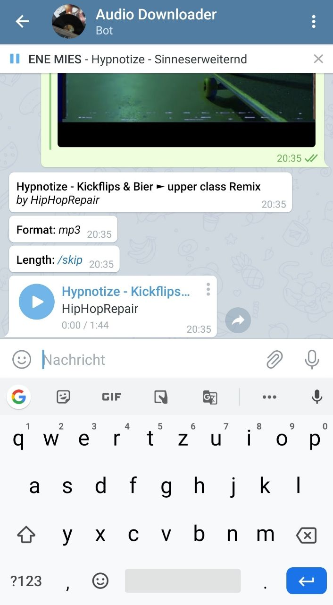

# JukeBot Telegram

This Telegram Bot uses [youtube-dl](https://youtube-dl.org/) to download audio and video files from YouTube and several other platforms allowing them to be played offline with the telegram music player.

### Setup

Modify config_template.py and rename it to config.py

`BOT_TOKEN` - Your Bots API token (request it from @BotFather)

`ADMIN_UID` - The User ID of the Telegram account that should function as administrator. This user can use the commands `/grant <uid>` and `/revoke <uid>` to permit other users to interact with this Bot.  

`WORK_DIR` - The directory where files are downloaded to and temporary stored until they are sent to the Telegram servers.  

`WHITELIST_FILE` - The file used to store User IDs of users that are allowed to interact with this Bot.  

`YOUTUBE_COOKIE_FILE` - The YouTube cookie file. This is required to download files that are accessible only for 18+ accounts on YouTube.

### Run
`docker build -t jukebot-image .`  
`docker run -it --rm --name jukebot jukebot-image`

